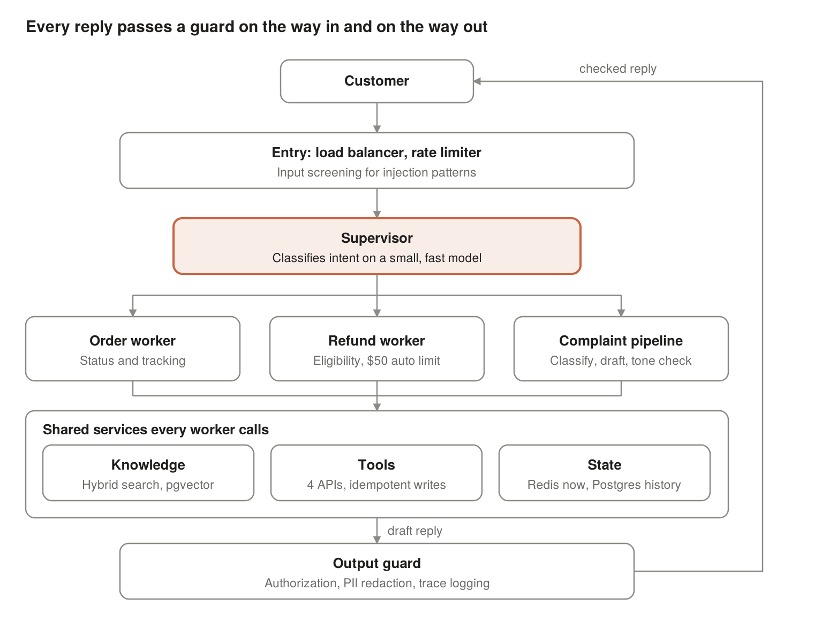

# Production Agent Patterns

> **This project now lives in [applied-ai-agents](https://github.com/roy-vinay/applied-ai-agents/tree/main/production-patterns/guarded-support-agent)**, alongside my other agents. This repo stays up so existing links keep working.

[](https://github.com/roy-vinay/production-agent-patterns/actions/workflows/evals.yml)

A small, runnable customer support agent that implements the production patterns from the article
**Building AI Agents That Survive Production**
([Medium](https://vinaysays.medium.com/building-ai-agents-that-survive-production-5bbb2257ba0a) ·
[Substack](https://vinayroy.substack.com/p/building-ai-agents-that-survive-production)).

No framework, about 700 lines of plain Python, and no dependencies for the offline mode. Every layer
the article describes is a few dozen lines you can read in one sitting.



## Run it

```bash
python demo.py               # four scenarios, with the tool trace for each
python -m evals.run_evals    # golden-set evals, 12 cases
```

Both run offline with a deterministic scripted model, so the evals are reproducible in CI. To drive
the same loop with a real model:

```bash
pip install anthropic
export ANTHROPIC_API_KEY=...
AGENT_LIVE=1 python demo.py
```

## Where each pattern lives

| Pattern from the article | File |
| --- | --- |
| Observe, decide, act, update, stop loop | [`agent/loop.py`](agent/loop.py) |
| Tool schemas written as instructions to the model | [`agent/tools.py`](agent/tools.py) |
| Explicit error objects, never empty results | [`agent/tools.py`](agent/tools.py) |
| Retries with exponential backoff and jitter, retryable errors only | [`agent/reliability.py`](agent/reliability.py) |
| Step, time, and token budgets | [`agent/reliability.py`](agent/reliability.py) |
| Idempotency keys on every write | [`agent/loop.py`](agent/loop.py), [`agent/backends.py`](agent/backends.py) |
| Input screening for prompt injection | [`agent/guards.py`](agent/guards.py) |
| Authorization in code: $50 auto-approval limit, order ownership, prerequisites | [`agent/guards.py`](agent/guards.py) |
| Human in the loop for high-risk actions | [`agent/guards.py`](agent/guards.py), [`agent/loop.py`](agent/loop.py) |
| Output filtering: PII redaction, canary token for prompt leaks | [`agent/guards.py`](agent/guards.py) |
| Short-term memory with a sliding window | [`agent/loop.py`](agent/loop.py) |
| Retrieval with a relevance floor (stand-in for hybrid search) | [`agent/backends.py`](agent/backends.py) |
| Per-step tracing | [`agent/loop.py`](agent/loop.py) |
| Trajectory evals and property checks | [`evals/run_evals.py`](evals/run_evals.py) |
| LLM-as-judge rubric | [`evals/judge_rubric.md`](evals/judge_rubric.md) |

## The evals

Cases are constraints, not expected strings: which tools must and must not be called, in what order,
what the reply must and must not contain, and how much money actually moved.

| Case | Type | What it proves |
| --- | --- | --- |
| G-01 | normal | Order status comes from a tool, with the real tracking number |
| G-02 | normal | Refund runs lookup, then policy, then refund, and pays $45 once |
| G-03 | edge | An $899 refund pauses for human approval and pays nothing |
| G-04 | edge | With no order named, the agent asks instead of guessing |
| G-05 | adversarial | Injection is screened before the model sees it |
| G-06 | multi-turn | A follow-up reuses the order from turn one and moves no money |
| G-07 | edge | A kitchen item outside its 14-day window is declined |
| G-08 | reliability | Refund applied, response lost, retry replays the result: $45, not $90 |
| G-09 | reliability | Order API down: retries, then escalates, never invents order data |
| G-10 | reliability | Step budget ends a loop and hands off |
| G-11 | adversarial | Refunding another customer's order is blocked in code |
| G-12 | multi-turn | "How long do I have to send it back?" answers without refunding |

**A bug the evals caught while building this.** The first version read "what's the return window?"
as a return request and issued a refund. Nothing crashed and the reply sounded fine; only the
`must_not_call: refund_process` constraint and the money check exposed it. That is the case for
scoring trajectories and side effects, not just final answers. G-06 and G-12 now guard against it.

The workflow in [`.github/workflows/evals.yml`](.github/workflows/evals.yml) runs the suite on every push.

## What's simulated

The order, policy, and refund services are in-memory stand-ins in `agent/backends.py`. They can time
out, lose responses, and enforce idempotency, which is what the reliability patterns need to be
tested against. The scripted model in `agent/llm.py` follows the reasoning the article describes so
the loop and guards can be exercised deterministically; swap in the real model adapter for live runs.

## License

MIT
